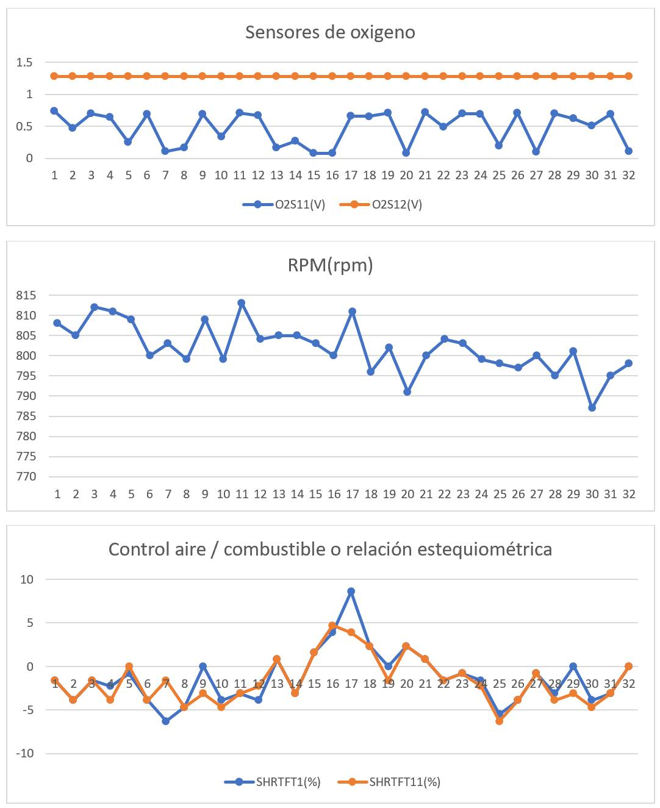

# OBDII2Charts

El propósito de este proyecto es interpretar los datos recibidos de un scanner OBD2 y representarlos de manera gráfica para permitir un mejor análisis.

*Estos gráficos se generaron a partir de los datos obtenidos de un scanner AutoLink AL539 el cual tiene 3 slots de memoria de 32 ciclos, la prueba se realizó a un Sonic 2016 que no presenta códigos DTC pero si arroja alertas en la prueba I/M de O2S y CAT*